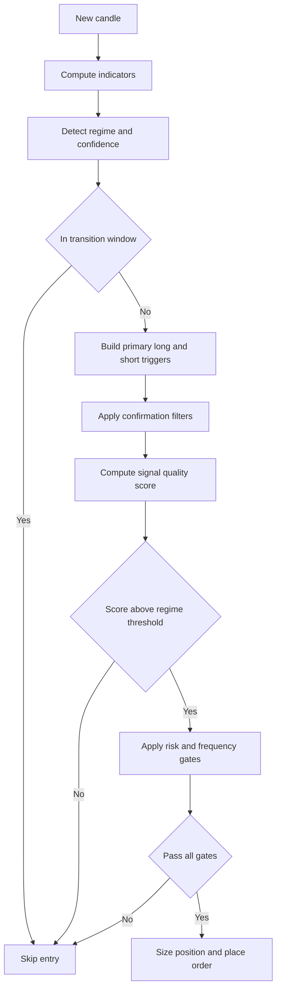

# All-Weather Trading Strategy Design

## 1. Objective and Design Constraints

This document specifies a regime-adaptive trading strategy that is robust across trending, ranging, and volatile market conditions for BTC, ETH, and SOL on 15m bars.

### 1.1 Core Objectives

- Maximize risk-adjusted returns across regime shifts
- Prevent overtrading and fee drag in choppy markets
- Preserve strict backtest-live parity
- Use data and features already available in the current system

### 1.2 Non-Negotiable Constraints

- Backtest and live strategy logic must remain identical
- New strategy behavior must be implemented in backtest pathway first, then mirrored in live
- Strategy remains bi-directional as selected: long and short entries are allowed in all regimes when quality is high
- Use Polars for data transformations and feature engineering where tabular workflows are involved
- Include realistic execution assumptions: maker and taker fees, slippage, liquidity depth, latency

---

## 2. Existing Components to Reuse

### 2.1 Regime Detection

Reuse [`AdaptiveMarketRegimeDetector`](../src/indicators/market_regime.py:181) and centralized [`REGIME_PROFILES`](../src/indicators/market_regime.py:28).

Already available and should be preserved:

- Dynamic thresholds and historical percentile adaptation
- Hurst exponent tie-breaker
- Regime smoothing and transition buffer
- Regime suitability hooks
- Profile driven controls: signal threshold, ATR multipliers, cooldowns, daily limits, time limits

### 2.2 Signal Detection

Reuse [`EnhancedSignalDetector`](../src/indicators/enhanced_signal_detector.py:75) with enhancements to scoring and confirmations.

Already available:

- Trend and mean-reversion candidate generators
- Weighted combination model
- Volume penalty
- Exit signal helper methods

### 2.3 Execution and Risk Infrastructure

- Position sizing: [`PositionSizer.calculate_all_weather_position_size()`](../src/risk/position_sizer.py:498)
- Exit manager: [`AllWeatherExitManager`](../src/risk/exit_manager.py:49)
- Strategy orchestration and gating: [`BacktestStrategyEngine.process_candle()`](../src/backtest/strategy_engine.py:766)
- Fees: [`FeeSchedulePresets.delta_exchange()`](../src/backtest/fees/fee_calculator.py:131)
- Slippage and orderbook depth simulation: [`BacktestOrderSimulator`](../src/backtest/mock/order_simulator.py:254), [`SimulatedOrderBook`](../src/backtest/market/order_book.py:180)

---

## 3. All-Weather Signal Architecture

### 3.1 Signal Stack Overview

Use a layered architecture:

1. Regime detection and transition check
2. Regime-specific primary trigger
3. Confirmation filter bundle
4. Regime suitability and risk gate
5. Composite score and entry decision
6. Position sizing and order routing



### 3.2 Regime-Adaptive Primary Triggers

#### Trending Up and Trending Down

Primary intent: momentum continuation with pullback tolerance.

Long trigger candidates in up environments:

- EMA structure alignment: EMA9 above EMA21 above EMA50
- Fresh bullish crossover with ADX support
- Breakout above rolling 20-bar high with momentum confirmation

Short trigger candidates in down environments:

- EMA structure alignment: EMA9 below EMA21 below EMA50
- Fresh bearish crossover with ADX support
- Breakdown below rolling 20-bar low with momentum confirmation

Symmetric counter-trend entries are permitted but receive lower suitability and stricter score requirements.

#### Ranging

Primary intent: mean reversion at statistically stretched edges.

Long candidates:

- RSI oversold region and bullish divergence
- Price near lower Bollinger zone or support pivot cluster
- Candle rejection behavior at lower range boundary

Short candidates:

- RSI overbought region and bearish divergence
- Price near upper Bollinger zone or resistance pivot cluster
- Candle rejection behavior at upper range boundary

#### Volatile

Primary intent: selective participation with lower exposure.

Candidates:

- Volatility expansion breakout with volume confirmation
- Only act when breakout and directional momentum align
- Mean-reversion attempts in volatile regime require extra confirmation and lower allocation

### 3.3 Multi-Factor Confirmation Filters

Each candidate direction must pass a confirmation bundle:

- Volume confirmation:
  - current_volume divided by rolling_volume_mean scaled by regime volume multiplier
- Volatility sanity:
  - ATR percent below hard cap for non-volatile regimes
  - in volatile regime, require breakout context rather than rejecting all high ATR
- Market structure:
  - distance to nearest support or resistance not immediately unfavorable
  - avoid entries directly into strong opposing level
- Regime confidence:
  - regime confidence above minimum operative floor
- Transition guard:
  - block entries during regime transition buffer

### 3.4 Composite Signal Quality Score

Define per direction score in normalized range 0 to 1:

`quality_score = w_primary * primary_score + w_confirm * confirm_score + w_regime * regime_alignment_score + w_structure * structure_score`

Recommended default weights by regime:

- Trending: primary 0.45, confirm 0.20, regime 0.25, structure 0.10
- Ranging: primary 0.35, confirm 0.25, regime 0.20, structure 0.20
- Volatile: primary 0.30, confirm 0.35, regime 0.20, structure 0.15

Direction chosen:

- If long score and short score both below threshold: no trade
- If one exceeds threshold and is greater by decision margin: take that side
- If both exceed and are close: skip to avoid ambiguity

Decision margin recommendation:

- trending 0.08
- ranging 0.10
- volatile 0.12

---

## 4. Dynamic Risk Management Design

### 4.1 Regime Specific ATR Stop Logic

Base stop distance:

`stop_distance = ATR * atr_multiplier`

Use profile multipliers (defined in section 6). Enforce floor and cap checks to avoid pathological distances.

### 4.2 Regime Specific Risk Reward Targets

Use multi target ladder:

- TP1 for risk reduction
- TP2 for base target capture
- TP3 optional runner objective or trailing-only continuation

General template:

- TP1 at 1.0R partial close
- TP2 at regime RR target
- TP3 via trailing extension or fixed 3.0R depending on regime

### 4.3 Position Sizing

Position notional is a product of:

- Base risk sizing from stop distance
- Signal strength factor
- Regime modifier
- Performance factor
- Drawdown factor

In volatile conditions:

- clamp size aggressively
- widen stop moderately
- maintain lower effective leverage

In ranging conditions:

- lower size than trend regimes to control chop losses

### 4.4 Drawdown Aware Protection

Drawdown ladder should be stricter than current broad thresholds for this strategy:

- dd above 0.05: scale to 0.75
- dd above 0.08: scale to 0.50
- dd above 0.10: scale to 0.25
- dd above 0.12: no new entries

This complements existing sizing function and can be parameterized in profile config.

---

## 5. Exit Strategy Design

### 5.1 Exit Priority

Order of precedence from most urgent to least:

1. Hard stop loss
2. Regime change emergency exit
3. Time stop
4. Trailing stop and retracement protection
5. Planned take profit events

### 5.2 Take Profit Framework

Use regime dependent partial scale plan:

- Trending regimes:
  - TP1 at 1.2R close 20%
  - TP2 at 2.5R close 30%
  - remainder via trailing
- Ranging regime:
  - TP1 at 0.8R close 30%
  - TP2 at 1.6R close 50%
  - residual 20% with tight trail or boundary touch exit
- Volatile regime:
  - TP1 at 1.0R close 35%
  - TP2 at 2.0R close 40%
  - residual 25% with wide trail and strict retracement lock

### 5.3 Trailing Stop Logic

Activation:

`trail_active when unrealized_pnl_atr >= trailing_activation_atr`

Distance:

`trail_distance = ATR * trailing_distance_atr`

Retracement protection:

`exit when profit_retracement_pct from peak exceeds profile threshold`

### 5.4 Time Based Exit Rules

Use regime specific hold limits from profile:

- shorter in volatile and ranging environments
- longer in trends to allow continuation

If time limit is hit and trade has not reached minimum progress threshold, close.

Progress threshold:

- trending: at least 0.5R progress
- ranging: at least 0.3R progress
- volatile: at least 0.7R progress

### 5.5 Regime Change Exits

When open direction becomes strongly unsuitable under new regime and confidence is high:

- force full exit or at least aggressive de-risking
- volatile regime transition can trigger faster exit especially when spread and slippage conditions worsen

---

## 6. REGIME_PROFILES Configuration Proposal

```python
REGIME_PROFILES = {
    "trending_up": {
        "signal_threshold": 0.62,
        "decision_margin": 0.08,
        "atr_multiplier": 2.8,
        "rr_ratio": 2.4,
        "tp1_r": 1.2,
        "tp1_scale": 0.20,
        "tp2_r": 2.5,
        "tp2_scale": 0.30,
        "use_trailing_tp": True,
        "trailing_activation_atr": 1.0,
        "trailing_distance_atr": 1.8,
        "profit_retracement_pct": 0.40,
        "position_size_mod": 1.00,
        "cooldown_candles": 6,
        "max_trades_per_day": 3,
        "time_limit_hours": 72,
        "volume_multiplier": 1.10,
        "trend_weight": 0.85,
        "mr_weight": 0.15,
        "breakeven_atr": 0.9,
        "suitability_long": 1.0,
        "suitability_short": 0.65,
    },
    "trending_down": {
        "signal_threshold": 0.62,
        "decision_margin": 0.08,
        "atr_multiplier": 2.8,
        "rr_ratio": 2.4,
        "tp1_r": 1.2,
        "tp1_scale": 0.20,
        "tp2_r": 2.5,
        "tp2_scale": 0.30,
        "use_trailing_tp": True,
        "trailing_activation_atr": 1.0,
        "trailing_distance_atr": 1.8,
        "profit_retracement_pct": 0.40,
        "position_size_mod": 1.00,
        "cooldown_candles": 6,
        "max_trades_per_day": 3,
        "time_limit_hours": 72,
        "volume_multiplier": 1.10,
        "trend_weight": 0.85,
        "mr_weight": 0.15,
        "breakeven_atr": 0.9,
        "suitability_long": 0.65,
        "suitability_short": 1.0,
    },
    "ranging": {
        "signal_threshold": 0.70,
        "decision_margin": 0.10,
        "atr_multiplier": 2.0,
        "rr_ratio": 1.6,
        "tp1_r": 0.8,
        "tp1_scale": 0.30,
        "tp2_r": 1.6,
        "tp2_scale": 0.50,
        "use_trailing_tp": True,
        "trailing_activation_atr": 0.6,
        "trailing_distance_atr": 1.2,
        "profit_retracement_pct": 0.35,
        "position_size_mod": 0.35,
        "cooldown_candles": 12,
        "max_trades_per_day": 2,
        "time_limit_hours": 20,
        "volume_multiplier": 1.30,
        "trend_weight": 0.25,
        "mr_weight": 0.75,
        "breakeven_atr": 0.6,
        "suitability_long": 0.75,
        "suitability_short": 0.75,
    },
    "volatile": {
        "signal_threshold": 0.78,
        "decision_margin": 0.12,
        "atr_multiplier": 3.6,
        "rr_ratio": 2.2,
        "tp1_r": 1.0,
        "tp1_scale": 0.35,
        "tp2_r": 2.0,
        "tp2_scale": 0.40,
        "use_trailing_tp": True,
        "trailing_activation_atr": 1.4,
        "trailing_distance_atr": 2.6,
        "profit_retracement_pct": 0.30,
        "position_size_mod": 0.20,
        "cooldown_candles": 20,
        "max_trades_per_day": 1,
        "time_limit_hours": 10,
        "volume_multiplier": 1.60,
        "trend_weight": 0.55,
        "mr_weight": 0.45,
        "breakeven_atr": 1.2,
        "suitability_long": 0.55,
        "suitability_short": 0.55,
    },
}
```

### 6.1 Key Changes Versus Current Live Parameters

- Increase signal thresholds in ranging and volatile regimes to reduce overtrading
- Reduce position size modifiers in ranging and volatile regimes
- Tighten daily trade limits and increase cooldown in choppy regimes
- Improve trend runner behavior with clearer TP and trailing structure

---

## 7. Regime Specific Entry and Exit Rule Matrix

| Regime | Entry Style | Confirmations | Size | Stop | Exit Bias |
|---|---|---|---:|---:|---|
| trending_up | momentum and breakout long favored, short allowed with stricter score | ADX, EMA structure, volume | 1.00x | 2.8 ATR | trail winners, longer hold |
| trending_down | momentum and breakdown short favored, long allowed with stricter score | ADX, EMA structure, volume | 1.00x | 2.8 ATR | trail winners, longer hold |
| ranging | mean reversion at range edges | RSI extremes, pivots, BB stretch, structure | 0.35x | 2.0 ATR | faster TP and shorter hold |
| volatile | volatility breakout only with strong confirmation | breakout, momentum, volume, spread sanity | 0.20x | 3.6 ATR | fast risk reduction and protective trailing |

---

## 8. Integration Recommendations

### 8.1 Components to Leverage Directly

- Keep regime engine as single source for profile lookup and gating
- Keep enhanced detector structure and extend scoring rather than replacing
- Keep exit manager multi-factor architecture and add partial TP implementation
- Keep strategy engine as central coordinator for parity

### 8.2 New Components to Add

1. `src/indicators/signal_quality.py`
   - directional composite scoring helpers
   - consistent normalization methods
2. `src/risk/regime_risk_router.py`
   - pure functions mapping regime profile to stop, rr, TP ladder, drawdown clamps
3. `src/strategy/regime_policy.py`
   - policy guardrails for transitions, ambiguity skip, and suitability map

These should be deterministic and stateless where possible to simplify parity tests.

### 8.3 Minimal Refactors

- Extend [`EnhancedSignalDetector.check_entry_signal()`](../src/indicators/enhanced_signal_detector.py:118) to output score decomposition per direction
- Extend [`AllWeatherExitManager`](../src/risk/exit_manager.py:49) to support configurable multi-level partial exits
- Ensure [`BacktestStrategyEngine.process_candle()`](../src/backtest/strategy_engine.py:766) consumes new fields without diverging logic paths

### 8.4 Execution Realism and Guardrails

- Keep fee model via [`FeeSchedulePresets.delta_exchange()`](../src/backtest/fees/fee_calculator.py:131)
- Keep dynamic slippage and depth aware fills in simulator
- Add spread sanity check before entry in volatile regime
- Maintain expected profit vs fee gate and tune multiplier per regime

---

## 9. Backtest to Live Parity Specification

### 9.1 Parity Rules

- One canonical strategy parameter source for both environments
- No live only overrides for thresholds, multipliers, or exit conditions
- Same order of operations: detect regime, score, gate, size, execute, manage exits
- Same rounding and fee assumptions where possible

### 9.2 Validation Artifacts

1. Deterministic fixture tests for signal and size outcomes
2. Regime transition replay tests
3. Golden dataset snapshot checks for BTC, ETH, SOL
4. End to end comparison report with matched seeds and slippage settings

---

## 10. Performance and Data Engineering Notes

- Continue to use NumPy for vectorized indicator calculations
- Use Polars for tabular backtest analytics, parameter sweep aggregation, and trade diagnostics
- Avoid loop-heavy post-processing over large trade datasets; prefer vectorized or expression-based transforms

Example Polars workflow expectations:

- Compute per-regime trade stats
- Fee to gross PnL ratio by regime and symbol
- Holding time distributions and exit reason attribution

---

## 11. Implementation Sequence Recommendation

1. Add config schema extensions for proposed profile fields
2. Add signal quality decomposition and ambiguity skip logic
3. Add TP ladder and partial exit controls in exit manager
4. Add stricter drawdown ladder and regime specific risk clamps
5. Add parity tests and golden snapshots
6. Run multi-year validation and compare with baseline on return, Sharpe, drawdown, trade count, fee drag

---

## 12. Acceptance Criteria

A design implementation is considered successful when:

- Strategy runs unchanged for BTC, ETH, and SOL in both backtest and live paths
- 2025 style choppy periods show materially reduced overtrading relative to current all-weather implementation
- Fee drag and drawdown are reduced while preserving reasonable upside in 2023 and 2024 type trends
- All new behavior is profile-driven and auditable

---

## 13. Plan for Next Mode Execution

The next implementation phase in code mode should:

- Implement the profile field extensions first
- Wire score decomposition without breaking existing signal type enums
- Keep all existing function signatures stable where possible
- Add tests before tuning loops

This keeps migration controlled and preserves system reliability while improving all-weather robustness.
