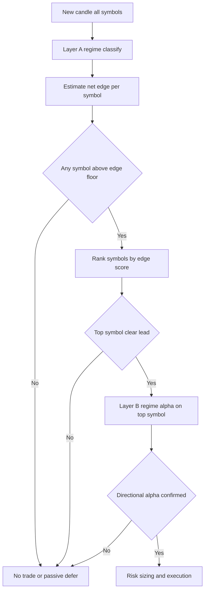
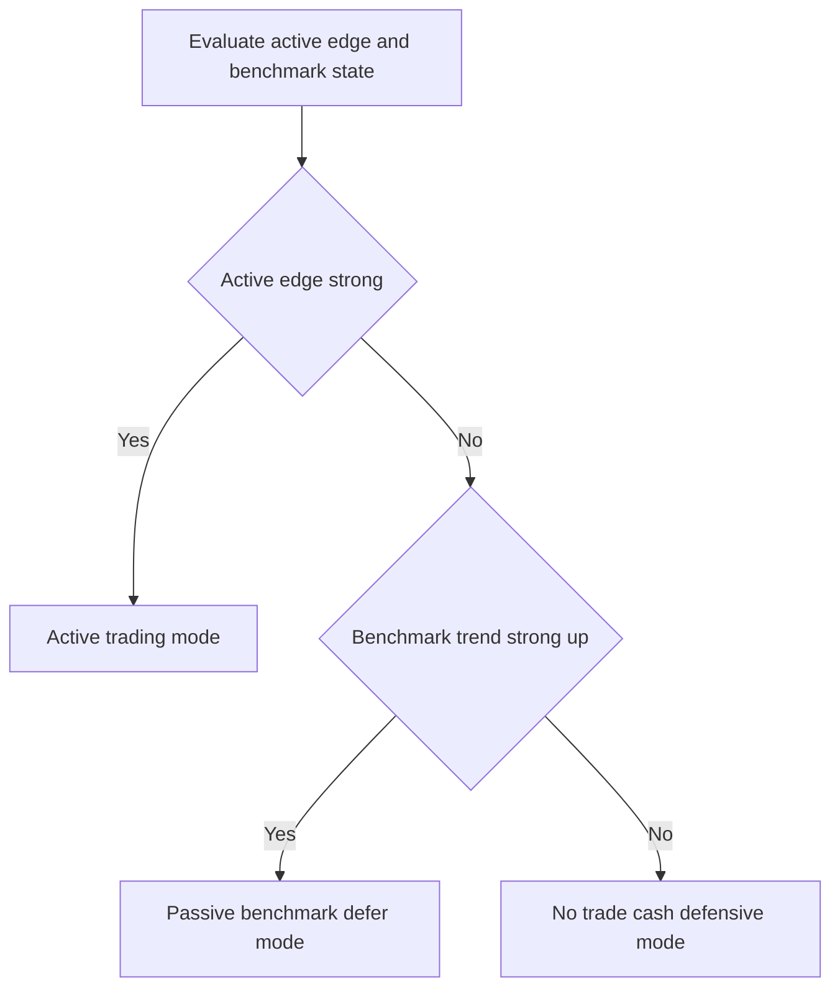

# Expectancy-Positive Redesign Blueprint

## 1. Purpose, Scope, and Hard Constraints

This blueprint defines an implementation-ready redesign to move the strategy from negative expectancy toward robust positive expectancy across trending, ranging, and volatile regimes.

This is design only. No strategy code changes are part of this subtask.

### Hard constraints

- Keep backtest and live logic on one shared strategy path.
- Any strategy change is implemented and validated in backtest first, then mirrored to live.
- Keep complexity bounded and implementable in the current codebase.
- Use bounded parameters only and enforce anti-overfitting controls.

### Evidence used

- [docs/all_weather_validation_report.md](docs/all_weather_validation_report.md)
- [docs/root_cause_diagnosis.md](docs/root_cause_diagnosis.md)
- [docs/profitability_improvement_plan.md](docs/profitability_improvement_plan.md)

---

## 2. Failure Anchors and Redesign Thesis

Current behavior is structurally negative expectancy due to:

- very low win rate around 21 percent
- stop-loss dominated exits around 85 percent
- weak payoff profile where losses are larger than wins
- overtrading relative to true signal quality

### Redesign thesis

The redesign shifts from hit-rate chasing to positive net expectancy per trade and per regime:

1. Only trade when estimated net edge is positive after costs.
2. Engineer asymmetric payoff so average winner is meaningfully larger than average loser.
3. Use explicit no-trade and passive-defer states when edge is weak.
4. Concentrate active risk on the best available opportunity instead of broad concurrent low-quality exposure.

---

## 3. Expectancy Framework Redesign

## 3.1 Core expectancy equations

Define per-trade expectancy in R units:

- E_R = p_win * W_R - p_loss * L_R - C_R
- p_loss = 1 - p_win
- L_R is normalized to 1.0 by stop definition
- W_R is realized average winner in R
- C_R is expected execution cost in R

Break-even win rate:

- p_break_even = (L_R + C_R) / (W_R + L_R)

Win rate needed for target expectancy E_target:

- p_target = (L_R + C_R + E_target) / (W_R + L_R)

Portfolio expectancy:

- E_portfolio = sum over regimes of regime_weight * E_R_regime

## 3.2 Regime-level expectancy targets and required win-rate-payoff combinations

Assume L_R = 1.0 and E_target = +0.10R.

| Regime | Cost C_R assumption | Target W_R | Break-even win rate | Win rate for +0.10R | Design intent |
|---|---:|---:|---:|---:|---|
| trending | 0.12 | 2.2 | 35.0% | 38.1% | moderate win rate with strong payoff |
| ranging | 0.18 | 1.5 | 47.2% | 51.2% | higher hit-rate mean reversion |
| volatile breakout | 0.22 | 3.0 | 30.5% | 33.0% | low hit-rate but large wins |
| quiet | 0.10 | 1.8 | 39.3% | 42.9% | selective continuation and pullback |

### Regime acceptance minimums

For any regime to remain active:

- estimated E_R must be above +0.03R on rolling out-of-sample windows
- bootstrap lower confidence bound of E_R must stay above 0.00R for that regime

If not, regime is auto-throttled or disabled by kill switch.

## 3.3 Bounded expectancy-control parameters

| Parameter | Default | Allowed range | Purpose |
|---|---:|---:|---|
| edge_floor_trend | 0.10R | 0.06R to 0.16R | minimum edge to enter trend trades |
| edge_floor_range | 0.08R | 0.05R to 0.14R | minimum edge for range trades |
| edge_floor_volatile | 0.14R | 0.10R to 0.20R | higher floor for volatile costs |
| edge_floor_quiet | 0.07R | 0.04R to 0.12R | selective low-vol entries |
| top1_lead_margin | 0.05 | 0.03 to 0.08 | separation from second-best symbol |
| expected_cost_buffer_mult | 2.8 | 2.2 to 3.4 | conservative cost inflation |

---

## 4. Signal Architecture Redesign

Two-layer architecture:

- Layer A: regime classifier and activation gate
- Layer B: regime-specific directional alpha models

## 4.1 Layer A: regime classifier and trade activation gate

Inputs from existing infrastructure:

- regime and confidence
- directional score and margin
- volatility sanity and transition status
- liquidity and spread checks
- expected net edge after cost buffer

Activation output states:

- ACTIVE_TREND
- ACTIVE_RANGE
- ACTIVE_BREAKOUT
- PASSIVE_ONLY
- NO_TRADE

### Hard no-trade states

Entry is blocked when any of these is true:

1. regime confidence below floor
2. regime transition buffer active
3. directional ambiguity margin below threshold
4. expected net edge below regime floor
5. spread or slippage proxy exceeds cap
6. drawdown circuit breaker blocks entries
7. regime-level kill switch active

## 4.2 Symbol selection policy across BTC ETH SOL

To reduce overtrading and concentrate on best edge:

- score every symbol each decision cycle
- score formula:
  - edge_score = estimated_E_R * regime_confidence * direction_margin * liquidity_quality
- open new trade only on top-ranked symbol when:
  - edge_score_top >= regime edge floor
  - edge_score_top - edge_score_second >= top1_lead_margin
- if lead condition fails, do not open new trade

This is intentionally top-1 selective to improve expectancy quality and reduce churn.

## 4.3 Layer B: regime-specific directional alpha models

### Trending model

- continuation pullback entries with structure alignment
- breakout continuation entries with volume confirmation
- invalidation when trend structure breaks and momentum decays

### Ranging model

- edge-of-range mean reversion only
- require rejection and structure confirmation near support or resistance
- invalidation on range break with momentum expansion

### Volatile breakout model

- breakout and momentum agreement required
- no countertrend entries in high-vol regime unless special override passes
- invalidation on failed breakout return inside range

### Quiet model

- selective low-frequency entries only
- stricter ambiguity filter to avoid noise trading

---

## 5. Risk and Trade Management Redesign

## 5.1 Volatility targeting and exposure budgeting

### Portfolio volatility target

- target annualized portfolio volatility default 12 percent
- bounded range 10 to 14 percent
- vol scalar bounded 0.50 to 1.30

### Regime risk budget and per-trade risk

| Regime | Base per-trade risk default | Allowed range | Regime budget share |
|---|---:|---:|---:|
| trending | 0.50% | 0.35% to 0.70% | 45% |
| ranging | 0.30% | 0.20% to 0.45% | 20% |
| volatile | 0.22% | 0.15% to 0.35% | 25% |
| quiet | 0.25% | 0.20% to 0.40% | 10% |

### Exposure limits

- max new entries per bar: 1
- max concurrent active positions: 2
- second position allowed only if both symbols pass elevated edge floor and remain within portfolio risk caps

## 5.2 Stop architecture for asymmetric payoff

Use structure plus ATR hybrid stop:

- raw_atr_stop = ATR * atr_multiplier
- structure_stop = distance to invalidation structure plus buffer
- stop_distance = clamp max of raw_atr_stop and structure_stop by stop floor and cap

Regime ATR multipliers and stop clamps:

| Regime | ATR multiplier default | Allowed range | Stop floor | Stop cap |
|---|---:|---:|---:|---:|
| trending | 4.0 | 3.6 to 4.6 | 1.8% | 6.5% |
| ranging | 3.0 | 2.6 to 3.4 | 1.6% | 5.2% |
| volatile | 4.8 | 4.4 to 5.4 | 2.5% | 8.5% |
| quiet | 3.3 | 3.0 to 3.8 | 1.5% | 5.8% |

## 5.3 Exit architecture to lift payoff ratio

### Scale-out and runner framework

| Regime | TP1 | TP1 scale | TP2 | TP2 scale | Runner |
|---|---:|---:|---:|---:|---|
| trending | 1.3R | 25% | 3.0R | 35% | trailing 40% |
| ranging | 1.1R | 35% | 2.2R | 45% | trailing 20% |
| volatile | 1.6R | 35% | 3.4R | 35% | trailing 30% |
| quiet | 1.2R | 30% | 2.5R | 40% | trailing 30% |

### Exit rules

1. hard stop and emergency invalidation first
2. TP1 triggers partial de-risk and stop move toward break-even with fee buffer
3. TP2 realizes core payoff
4. runner managed by trailing and retracement lock
5. time-in-trade exit if progress is below regime minimum R threshold

### Invalidation exits

- trend invalidation: structure break and momentum decay
- range invalidation: confirmed range break beyond tolerance
- breakout invalidation: failed breakout with return to prior value zone

## 5.4 Capital protection layer

### Drawdown circuit breaker ladder

| Stage | Equity drawdown | New entries | Risk multiplier |
|---|---:|---|---:|
| D0 | below 4% | normal | 1.00 |
| D1 | 4% to 6% | allowed | 0.75 |
| D2 | 6% to 8% | trend and breakout only | 0.50 |
| D3 | 8% to 10% | top-edge only | 0.25 |
| D4 | 10% to 12% | blocked | 0.00 |
| D5 | above 12% | active kill switch | 0.00 |

### Regime-level kill switch

Disable entries for a regime when rolling diagnostics fail:

- rolling regime expectancy below -0.05R
- and win-rate below required break-even by at least 5 percentage points
- observed across two consecutive monitoring windows

Reactivation requires positive rolling expectancy and gate pass for recovery window.

---

## 6. Benchmark-Aware Deployment Logic

## 6.1 Benchmark definition

Primary benchmark:

- configurable portfolio benchmark
- default equal weight buy and hold of BTC ETH SOL
- if production weights exist, benchmark uses those weights

## 6.2 Active versus passive versus no-trade policy

Use a deploy-time state machine:

### State conditions

- Active mode:
  - rolling active edge above floor
  - risk breakers not active
- Passive defer mode:
  - benchmark directional strength high
  - active edge below floor
  - underperformance risk rising
- No-trade defensive mode:
  - active edge below floor and benchmark directional edge weak

## 6.3 Benchmark-relative guardrails

To avoid catastrophic underperformance in strong directional years:

1. up-year capture guardrail:
   - when benchmark annual return exceeds 30 percent
   - strategy must capture at least 60 percent of benchmark return or underperform by no more than 20 percentage points
2. drawdown guardrail:
   - strategy max drawdown must not exceed benchmark drawdown by more than 5 percentage points
3. live degradation guardrail:
   - if rolling 60-day underperformance exceeds 12 percentage points and active drawdown is above 8 percent, force passive defer or no-trade mode

---

## 7. Validation and Acceptance Redesign

## 7.1 Walk-forward protocol

### Data and fold structure

- timeframe 15m
- symbols BTC ETH SOL
- horizon 2023 through 2026
- fold template:
  - train 12 months
  - validate 3 months
  - test 3 months
  - roll forward 3 months

### Search policy

- tune only bounded global knobs
- max candidates per fold: 64
- freeze selected settings before out-of-sample test
- produce stitched out-of-sample equity and regime-level diagnostics

## 7.2 Adversarial stress matrix

| Scenario | Stress change | Goal |
|---|---|---|
| S0 baseline | realistic costs and latency | reference |
| S1 pessimistic costs | fees and slippage uplift | cost robustness |
| S2 spread shock | spread multiplier 1.5x and 2.0x | liquidity stress |
| S3 latency shock | latency 3x with timeout pressure | execution stress |
| S4 depth haircut | order book depth reduced 40% | fill realism stress |
| S5 regime noise | inject regime misclassification noise | classification robustness |
| S6 signal delay | delay entries and exits by one candle | timing fragility check |
| S7 combined adverse | S1 plus S2 plus S3 plus S5 | worst-case resilience |

## 7.3 Strict deploy gates

### Expectancy and payoff gates

- stitched out-of-sample expectancy at least +0.08R per trade
- 95 percent bootstrap lower bound of stitched expectancy above 0.00R
- average winner to average loser ratio at least 1.8 overall
- per-active-regime expectancy positive, with no regime below -0.03R

### Performance and risk gates

- annual net return positive in each target out-of-sample year
- stitched Sharpe at least 1.1
- per-year Sharpe at least 0.7
- stitched profit factor at least 1.15
- per-year profit factor at least 1.05
- stitched max drawdown at most 22 percent
- per-year max drawdown at most 20 percent

### Trade-quality gates

- stop-loss exit share reduced to at most 65 percent
- trade count reduced at least 30 percent versus failing baseline unless expectancy improves with equal or lower drawdown

### Benchmark-relative gates

- stitched Sharpe at least benchmark Sharpe minus 0.10
- strategy drawdown at most benchmark drawdown plus 5 percentage points
- up-year capture guardrail and underperformance cap must pass

### Stress gates

- S1 through S4: stitched net return remains positive
- S5 and S6: non-negative stitched expectancy
- S7 combined adverse: stitched return above -7 percent and max drawdown at most 30 percent

## 7.4 Statistical confidence requirements

- minimum stitched trade count for certification: 800
- minimum trades per active regime for certification: 120
- bootstrap confidence intervals reported for expectancy and payoff ratio
- parameter stability check in local neighborhood must keep expectancy sign positive

---

## 8. Anti-Overfitting Protections

- strict bounded parameter space only
- no year-specific rule branches
- no symbol-specific hacks keyed to historical winners
- no expanding knob budget without redesign approval
- walk-forward separation enforced
- final test always run on frozen parameters
- stress matrix pass required before promotion
- parity checks extended to include regime profiles and activation gates

---

## 9. Implementation Map and Phased Rollout

## 9.1 File-by-file change plan for code mode

| File | Planned updates | Why |
|---|---|---|
| [src/indicators/market_regime.py](src/indicators/market_regime.py) | add edge floors, benchmark mode fields, kill-switch profile fields, bounded defaults | central regime and gating config |
| [src/indicators/signal_quality.py](src/indicators/signal_quality.py) | compute edge score inputs and ambiguity strictness, expose top1 ranking helpers | two-layer signal architecture support |
| [src/indicators/enhanced_signal_detector.py](src/indicators/enhanced_signal_detector.py) | regime-specific alpha decomposition outputs for trend range breakout models | directional alpha per regime |
| [src/backtest/strategy_engine.py](src/backtest/strategy_engine.py) | implement Layer A gate, top1 symbol selection policy, no-trade states, expected-edge checks | expectancy-first activation logic |
| [src/risk/regime_risk_router.py](src/risk/regime_risk_router.py) | hybrid stop math, payoff ladder defaults, per-regime risk budget mapping | asymmetric payoff and bounded risk |
| [src/risk/exit_manager.py](src/risk/exit_manager.py) | invalidation exits, scale-out and runner logic refinements, min-hold fail-safe ordering | better winner retention and loser control |
| [src/risk/position_sizer.py](src/risk/position_sizer.py) | volatility target scalar and drawdown ladder unification | stable exposure control |
| [src/backtest/engine.py](src/backtest/engine.py) | benchmark mode routing hooks and capital-protection state handling | active passive no-trade behavior |
| [scripts/sensitivity_analysis.py](scripts/sensitivity_analysis.py) | convert to bounded walk-forward experiment harness | robust validation workflow |
| [validate_strategy_parity.py](validate_strategy_parity.py) | add parity checks for profile fields and gate ordering | enforce backtest-live consistency rule |

## 9.2 Phased rollout order and rollback checkpoints

### Phase 0 baseline lock and instrumentation

- freeze current baseline artifacts
- snapshot current regime profiles and parity outputs
- rollback checkpoint R0

### Phase 1 Layer A activation gate and no-trade states

- add edge floors and strict entry gate ordering
- add top1 symbol selection with lead margin
- verify trade count contraction and edge-quality lift
- rollback checkpoint R1 if quality metrics degrade

### Phase 2 Layer B regime alpha refinement

- implement trend range breakout alpha decomposition
- calibrate win-probability maps used in expectancy estimation
- rollback checkpoint R2 if calibration is unstable out of sample

### Phase 3 Risk and exit redesign

- hybrid structure plus ATR stops
- TP scale-outs and runner trailing update
- invalidation exit integration
- rollback checkpoint R3 if payoff ratio or drawdown worsens

### Phase 4 Benchmark-aware deployment logic

- add active passive no-trade state machine
- add benchmark-relative guardrails and live degradation triggers
- rollback checkpoint R4 if benchmark guardrails conflict with parity or risk rules

### Phase 5 Certification

- run full walk-forward and stress matrix
- apply strict deploy gates and confidence checks
- produce promotion parameter pack only on full pass
- rollback checkpoint R5 if any hard gate fails

## 9.3 Safety checkpoints

At each phase:

1. run parity checks
2. verify no-look-ahead constraints and execution timing assumptions
3. compare behavior deltas versus baseline with explainability logs
4. require explicit pass on phase-specific acceptance checklist before moving forward

---

## 10. Go No-Go Deployment Decision Rules

Go only if all of the following hold:

- hard expectancy gates pass
- benchmark-relative gates pass
- stress matrix gates pass
- parity checks pass with no logic divergence

No-go if any hard gate fails. In no-go state:

- retain last certified configuration
- revert to prior rollback checkpoint
- document failure attribution before any new tuning cycle

---

## 11. Why Expectancy Should Improve Under This Blueprint

Expected performance mechanics are:

1. fewer but higher-quality entries due to strict Layer A edge gating and top1 opportunity selection
2. larger winners from regime-specific scale-out and runner logic
3. better loser control via hybrid invalidation-aware stops and drawdown circuit breakers
4. reduced catastrophic relative underperformance through benchmark-aware passive defer logic
5. stronger robustness from walk-forward plus adversarial stress certification before deployment

This directly targets the diagnosed failure profile while preserving strict backtest-live parity.