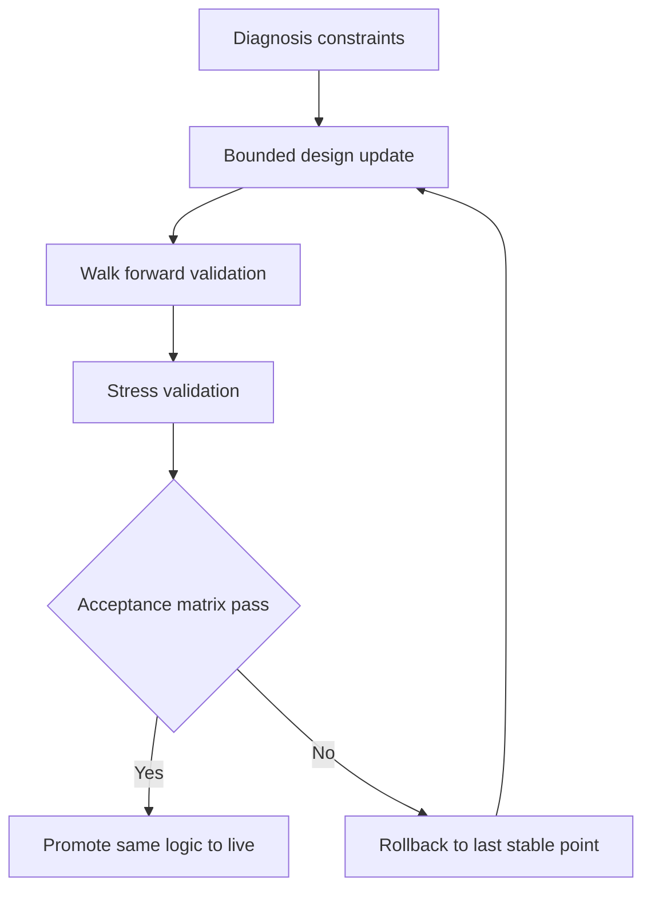

# Profitability Improvement Plan

## 1. Objective and Scope

This design specifies a **robust, anti-overfitting improvement plan** to move the current strategy toward cross-regime profitability while preserving strict backtest live parity.

### Inputs used

- [docs/root_cause_diagnosis.md](docs/root_cause_diagnosis.md)
- [docs/all_weather_strategy_design.md](docs/all_weather_strategy_design.md)
- [docs/all_weather_validation_report.md](docs/all_weather_validation_report.md)
- Current implementation in strategy, risk, and backtest modules

### Scope boundaries

- Design only, no strategy code changes in this subtask
- Practical and minimal complexity changes only
- Mandatory shared logic path between backtest and live

---

## 2. Design Principles and Guardrails

### 2.1 Walk-forward-first development

1. Propose bounded parameter updates
2. Validate via walk-forward train validate test windows
3. Approve only if acceptance matrix passes out of sample
4. Promote same logic and parameters to live config

### 2.2 Parameter parsimony

- Keep a compact parameter budget
- Use global scalers plus regime defaults instead of many free knobs
- Avoid per-year and per-asset exception rules unless universally justified

### 2.3 Backtest live parity as a hard constraint

- One canonical profile source for thresholds, ATR multipliers, TP ladder, and frequency controls
- Entry and exit order of operations must stay identical between environments
- Any strategy logic change lands in backtest pathway first, then mirrored for live

### 2.4 Explicit anti-overfitting constraints

- No year-specific threshold values
- No symbol-specific hacks keyed to historical winners or losers
- Bounded search space only
- Fixed acceptance criteria decided before final test run



---

## 3. Root Cause Anchors from Diagnosis

This plan directly addresses the diagnosed failure modes:

- Stop-loss exits dominate at about 84.7 percent
- Typical stop distance about 1.4 percent is too tight for crypto volatility
- Win rate about 21 percent indicates poor entry quality
- Win loss ratio is structurally weak
- Trade count is high for observed edge quality

Design objective is not curve fitting for any one year, but to improve:

- signal quality selectivity
- realized risk reward profile
- cost-adjusted expectancy
- drawdown stability under regime shifts

---

## 4. Parameter Architecture with Tight Bounds

## 4.1 Tunable knob budget

Only the following global knobs are tunable in walk-forward, all with pre-bounded ranges.

| Knob | Range | Purpose |
|---|---:|---|
| signal_threshold_offset | 0.00 to +0.08 | Raise entry quality floor |
| decision_margin_offset | 0.00 to +0.05 | Reduce ambiguous entries |
| atr_multiplier_scale | 1.00 to 1.25 | Widen stops in controlled way |
| tp_ladder_scale | 1.00 to 1.25 | Improve reward capture |
| cooldown_scale | 1.00 to 1.50 | Reduce low-quality trade frequency |
| cost_buffer_mult | 2.2 to 3.2 | Enforce positive net edge |

Everything else is fixed or selected from narrow regime ranges below.

## 4.2 Regime defaults and bounded ranges

### Signal thresholds and ambiguity margins

| Regime | signal_threshold range | default | decision_margin range | default |
|---|---:|---:|---:|---:|
| trending_up | 0.68 to 0.76 | 0.72 | 0.09 to 0.13 | 0.10 |
| trending_down | 0.68 to 0.76 | 0.72 | 0.09 to 0.13 | 0.10 |
| ranging | 0.74 to 0.82 | 0.78 | 0.11 to 0.15 | 0.12 |
| volatile | 0.82 to 0.90 | 0.86 | 0.13 to 0.18 | 0.15 |
| quiet | 0.66 to 0.74 | 0.68 | 0.10 to 0.14 | 0.12 |

### ATR stop multipliers and stop percent clamps

| Regime | atr_multiplier range | default | stop_pct_floor | stop_pct_cap |
|---|---:|---:|---:|---:|
| trending_up | 3.4 to 4.2 | 3.8 | 1.8% | 6.0% |
| trending_down | 3.4 to 4.2 | 3.8 | 1.8% | 6.0% |
| ranging | 2.6 to 3.2 | 2.9 | 1.6% | 5.0% |
| volatile | 4.2 to 5.0 | 4.6 | 2.5% | 8.0% |
| quiet | 3.0 to 3.6 | 3.2 | 1.5% | 5.5% |

### TP ladder ranges

| Regime | TP1 R range | TP1 scale | TP2 R range | TP2 scale | Runner |
|---|---:|---:|---:|---:|---|
| trending_up | 1.3 to 1.6 | 20 to 30% | 2.8 to 3.4 | 30 to 40% | trailing |
| trending_down | 1.3 to 1.6 | 20 to 30% | 2.8 to 3.4 | 30 to 40% | trailing |
| ranging | 1.0 to 1.3 | 25 to 35% | 2.0 to 2.6 | 45 to 55% | tight trailing or boundary exit |
| volatile | 1.4 to 1.8 | 30 to 40% | 3.0 to 3.8 | 35 to 45% | wide trailing |
| quiet | 1.1 to 1.4 | 20 to 30% | 2.2 to 2.8 | 40 to 50% | trailing |

### Trade frequency controls

| Regime | cooldown candles | max trades per day per symbol |
|---|---:|---:|
| trending_up | 8 to 12 | 2 |
| trending_down | 8 to 12 | 2 |
| ranging | 16 to 24 | 1 |
| volatile | 24 to 36 | 1 |
| quiet | 10 to 16 | 1 |

---

## 5. Strategy-Level Design Changes

## 5.1 Signal quality gating improvements

Entry requires a **multi-confirmation bundle** beyond raw detector score.

### Trending regimes

Require at least 2 of 3:

- ADX above trend floor
- EMA spread above minimum structure floor
- volume confirmation ratio above regime minimum

### Ranging regime

Require at least 2 of 3 with one mandatory structure element:

- RSI extreme and direction agreement
- support resistance proximity quality
- rejection divergence confirmation

### Volatile regime

Require at least 3 of 4:

- breakout condition
- directional momentum agreement
- volume confirmation
- volatility sanity and spread sanity pass

### Volatility sanity

- Non-volatile regimes enforce atr percent cap
- Volatile regime allows high ATR but requires breakout context
- Extreme ATR beyond cap blocks entry

## 5.2 Regime-specific threshold recalibration

- Raise signal thresholds and decision margins within tight bounds above
- Keep same thresholds across years
- Use only bounded global offsets during walk-forward tuning

## 5.3 Risk reward redesign

- Widen ATR stops and clamp by stop percent floor cap
- Upgrade TP ladder to larger R targets and reduce premature exits
- Keep trailing logic regime specific to preserve trend capture

## 5.4 Trade frequency controls

- Increase cooldown in ranging volatile quiet regimes
- Keep strict per-symbol daily trade caps
- Enforce ambiguity skip when directional scores are too close

---

## 6. Risk and Execution Design Changes

## 6.1 Stop-loss framework redesign

Use ATR adaptive stop with floor cap enforcement:

```text
raw_stop_distance = ATR * atr_multiplier
raw_stop_pct = raw_stop_distance / entry_price
clamped_stop_pct = clamp raw_stop_pct by regime floor cap
final_stop_distance = clamped_stop_pct * entry_price
```

Rationale:

- Addresses over-tight stops identified in diagnosis
- Prevents pathological tiny or extreme stops

## 6.2 Minimum hold mechanics with fail-safe exceptions

Add `min_hold_candles` to regime profiles.

- During minimum hold, block low-priority exits such as weak technical reversals
- Always allow fail-safe exits:
  - hard stop loss
  - severe regime flip with high confidence and low suitability
  - risk breach safety exit

Suggested range:

- trending 8 to 12 candles
- ranging 4 to 8 candles
- volatile 3 to 6 candles
- quiet 6 to 10 candles

## 6.3 Drawdown-aware throttling enhancements

Unify drawdown ladder behavior across router and position sizing:

- drawdown above 5 percent: 0.75 risk scale
- drawdown above 8 percent: 0.50 risk scale
- drawdown above 10 percent: 0.25 risk scale
- drawdown at or above 12 percent: no new entries

Add hysteresis to avoid rapid oscillation of risk state.

## 6.4 Cost-aware entry rejection

Replace simple fee check with conservative net-edge gate:

```text
estimated_cost = fees + slippage_buffer + spread_buffer + latency_buffer
expected_gross = size * stop_distance * blended_reward_r
expected_net_edge = expected_gross - estimated_cost
enter only if expected_net_edge > 0 and expected_gross / estimated_cost >= regime_min_ratio
```

Regime minimum reward cost ratio defaults:

- trending 2.5
- ranging 2.8
- volatile 3.2
- quiet 2.4

---

## 7. Validation Design

## 7.1 Walk-forward protocol over 2023 to 2026

### Data horizon

- 15m BTC ETH SOL
- 2023 through 2026 available history

### Fold template

- Train window: 12 months
- Validate window: 3 months
- Test window: 3 months
- Roll forward: 3 months per fold

### Search policy

- Tune only the six global knobs defined in section 4.1
- Bounded grid only, no ad hoc additions
- Maximum candidate count per fold: 64
- Selection metric is composite of return, Sharpe, drawdown, and turnover penalty

### Output artifacts per fold

- selected parameter vector
- validation scorecard
- out of sample test scorecard
- stitched out of sample equity and trade log

## 7.2 Stress protocol

| Scenario | Change set | Objective |
|---|---|---|
| S0 baseline | current realistic fee spread slippage latency | baseline reference |
| S1 pessimistic costs | maker and taker and slippage and latency uplift using pessimistic config | cost robustness |
| S2 spread shock | spread multiplier 1.5x and 2.0x in simulator | liquidity stress |
| S3 latency shock | latency multiplier 3x and timeout pressure | execution delay stress |
| S4 combined adverse | S1 plus S2 plus S3 | worst-case resilience |

## 7.3 Acceptance criteria matrix for robust profitability

Primary criterion follows selected hybrid rule.

### Definitions

- Weighted portfolio return uses production portfolio weights
- If production weights are not configured, default to equal weights across BTC ETH SOL
- Asset-year miss means one symbol in one year has negative net return

### Hard gates

| Criterion | Pass threshold |
|---|---|
| Weighted portfolio annual net return | positive in every target year |
| Asset-year misses | at most one across full out of sample horizon |
| Stitched out of sample Sharpe | at least 1.0 |
| Per-year Sharpe | at least 0.7 |
| Stitched max drawdown | at most 22 percent |
| Per-year max drawdown | at most 20 percent |
| Profit factor stitched | at least 1.10 |
| Profit factor per year | at least 1.00 |
| Stop-loss exit share | reduced from diagnosis baseline to at most 70 percent |
| Trade count | at least 25 percent lower than diagnosis baseline unless net edge improves with equal drawdown |

### Benchmark-relative gates

Benchmark is equal-weight buy and hold over same dates.

| Criterion | Pass threshold |
|---|---|
| Sharpe relative | strategy Sharpe greater than or equal to benchmark Sharpe |
| Drawdown relative | strategy max drawdown less than or equal to benchmark max drawdown |

### Stress gates

| Scenario set | Pass threshold |
|---|---|
| S1 to S3 | stitched net return remains positive |
| S4 combined adverse | stitched return above -5 percent and max drawdown at most 30 percent |

---

## 8. Anti-Overfitting Checklist

- [ ] Parameter budget limited to predefined knobs only
- [ ] All tuned values remain inside declared bounds
- [ ] No rule branches keyed to specific year
- [ ] No symbol-specific overrides unless tested as universal volatility class rule
- [ ] Walk-forward train validate test separation enforced
- [ ] Final test results use frozen rules from prior selection
- [ ] Sensitivity neighborhood check passes around chosen parameter set
- [ ] Stress scenarios pass before promotion
- [ ] Backtest live parity checks include profile and gating parity

---

## 9. Implementation Map by Module and Function

| File | Functions or areas to update | Design intent |
|---|---|---|
| src/indicators/market_regime.py | REGIME_PROFILES and profile schema | new bounded defaults, min hold, stop clamps, cost ratio fields |
| src/indicators/signal_quality.py | Directional score and confirmation helpers | enforce multi-confirmation and ambiguity skip |
| src/indicators/enhanced_signal_detector.py | check_entry_signal and combine logic | emit richer decomposed score inputs and confirmation flags |
| src/backtest/strategy_engine.py | generate_signal, process_candle, calculate_position_size, atr percent helper | central entry gating, frequency controls, cost-aware gate, bounded stop and TP usage |
| src/risk/regime_risk_router.py | risk parameter mapping and stop calculations | stop floor cap enforcement, TP ladder normalization, unified drawdown ladder |
| src/risk/exit_manager.py | time exit and regime exit checks | min hold logic with fail-safe exceptions |
| src/risk/position_sizer.py | drawdown factor path | remove duplicated ladder behavior and align with router policy |
| src/backtest/engine.py | position exit flow and strategy execution bridge | route exits through shared manager path for parity consistency |
| scripts/sensitivity_analysis.py | bounded walk-forward experiment harness | evaluate only approved knob set |
| validate_strategy_parity.py | parity checks expansion | verify profile and gating parity rules |

---

## 10. Phased Implementation Roadmap with Rollback Points

## Phase 0 Baseline lock

- Freeze current baseline metrics and artifacts
- Record current profile snapshot and parity check state
- **Rollback point R0** created

## Phase 1 Entry quality and frequency controls

- Implement multi-confirmation bundle and ambiguity skip
- Apply threshold and cooldown recalibration
- Validate trade count reduction and win rate improvement in validation folds
- **Rollback point R1** if validation does not improve quality metrics

## Phase 2 Stop and TP redesign

- Apply ATR widening with stop percent floor cap
- Implement upgraded TP ladder defaults
- Validate reduction in stop-loss dominance and improved reward profile
- **Rollback point R2** if stop-loss share and expectancy do not improve

## Phase 3 Hold and drawdown policy hardening

- Add min hold and fail-safe exceptions
- Unify drawdown throttling behavior
- Validate drawdown control without collapsing trade opportunity
- **Rollback point R3** if risk controls over-constrain strategy

## Phase 4 Cost-aware edge gating and parity hardening

- Implement conservative net-edge rejection gate
- Expand parity validation to include profile and gate consistency
- **Rollback point R4** if parity or edge calculations diverge between pathways

## Phase 5 Walk-forward and stress certification

- Run full walk-forward matrix
- Run stress scenarios S1 to S4
- Evaluate acceptance matrix and certify only on full pass
- Final output is promotion-ready parameter pack for live mirroring

---

## 11. Backtest Live Parity Enforcement Notes

- No live-only threshold or risk override
- Same regime profile source in both environments
- Same entry and exit ordering logic
- Same cost model assumptions at evaluation and deployment boundaries

This preserves the Strategy Consistency Rule while improving robustness against overfitting and regime drift.
