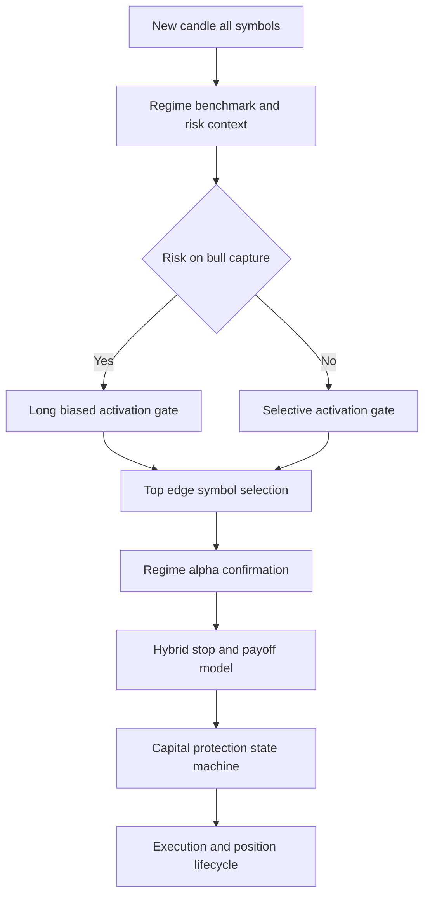
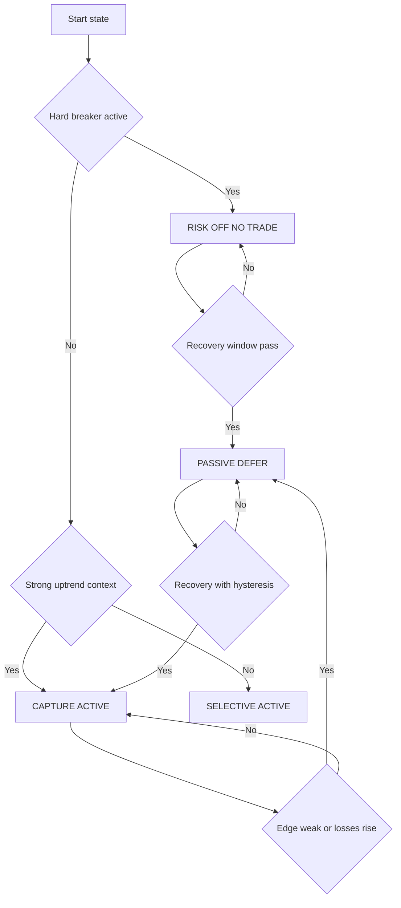

# V3 Pivot Strategy Design

## Subtask 11: Bull-Capture + Downside Protection Pivot

## 1. Scope, Objective, and Hard Constraints

This document defines an implementation-ready V3 strategy architecture that addresses the V2 certification failure profile and focuses on:

1. Bull-market participation and capture
2. Strict downside protection without over-defensive upside suppression
3. Backtest-live parity-safe shared logic
4. Bounded, anti-overfitting design controls

This is design only. No code changes are part of this subtask.

### Non-negotiable constraints

- Backtest and live must remain on one shared logic path
- Any strategy change is implemented and validated in backtest first, then mirrored to live
- No year-specific strategy branching
- No symbol-specific hacks tied to historical winners
- Parameter space remains bounded and auditable

---

## 2. Failure Anchors Driving the Pivot

V2 remains structurally non-deployable and fails key economic gates:

- Consistent yearly losses around negative 10 percent in 2023, 2024, 2025
- Severe underperformance in strong up years 2023 and 2024
- Negative Sharpe in all target years
- Win-rate improvement is insufficient for positive expectancy
- Payoff profile remains weak with stop-loss-dominated behavior

### Design implication

The pivot is not incremental threshold tuning. V3 must shift to a participation-first architecture in strong bull conditions while enforcing hard protection in adverse conditions.

---

## 3. V3 Core Concept and Rationale

## 3.1 Core concept

V3 uses a **Trend Participation Core + Tactical Protection Overlay**:

- Core engine concentrates on sustained trend participation in risk-on conditions
- Overlay enforces hard loss containment and regime-aware deactivation in poor conditions
- Strong-uptrend behavior is long-biased by default
- Tactical shorts are allowed only as constrained exceptions

## 3.2 Architecture overview

## 3.3 Why this should outperform V2 under realistic costs

1. **Bull capture restoration**
   - V2 over-suppresses participation in strong uptrends
   - V3 prioritizes staying active in healthy bull conditions unless hard breakers trigger

2. **Expectancy quality upgrade**
   - Edge floor + ambiguity veto + top1 lead concentration reduce weak trades
   - Reward-cost gating prevents entering mathematically poor trades

3. **Payoff asymmetry improvement**
   - Wider, structure-aware stops reduce premature exits
   - TP ladder plus runner retention increases realized winner size

4. **Controlled downside**
   - Drawdown ladder, loss-streak throttles, and regime kill switches cap tail risk
   - Re-entry hysteresis prevents oscillating between states

---

## 4. Regime and Activation Redesign

## 4.1 Operating modes

| Mode | Intent | Entry posture |
|---|---|---|
| RISK_ON_BULL_CAPTURE | Capture persistent bull trends | Long-biased active trading |
| RISK_ON_SELECTIVE | Trade only high-conviction setups | Symmetric but selective |
| PASSIVE_DEFER | Avoid low-edge overtrading while preserving reactivation path | Very strict entries only |
| RISK_OFF_NO_TRADE | Protect capital in adverse conditions | No new entries |

## 4.2 Risk-on bull-capture activation

Enter and remain in `RISK_ON_BULL_CAPTURE` when all hold:

- Regime is `trending_up`
- Regime confidence in 0.68 to 0.80 range, default 0.72 minimum
- Trend structure aligned: EMA fast above EMA medium above EMA trend
- Benchmark trend strength in 0.60 to 0.80 range, default 0.68 minimum
- Drawdown below 8 percent
- No hard circuit breaker active

## 4.3 Hard risk-off and no-trade conditions

Any true condition blocks new entries:

1. Regime confidence below floor
2. Regime transition buffer active
3. Directional ambiguity margin below veto threshold
4. Expected net edge below regime floor
5. Liquidity stress proxy breached
   - spread above 0.20 percent
   - ATR percent above extreme cap 8.0 percent
6. Drawdown breaker at blocking stage
7. Consecutive-loss cooldown active
8. Regime kill switch active

## 4.4 Directional constraints in strong macro uptrend

User-selected default policy is applied:

- **Long-biased in strong uptrend**
- Tactical shorts allowed only when all exception criteria pass

### Tactical short exception policy

Tactical short is allowed only if all are true:

- Regime is `volatile` or confirmed downside transition
- Short edge floor multiplier in 1.5 to 2.0 range over base floor, default 1.8
- Short size cap in 0.20 to 0.35 of normal risk, default 0.25
- Short hold cap in 6 to 16 candles, default 8
- No pyramiding of tactical shorts

## 4.5 Symbol activation and concentration

Across BTC ETH SOL:

- Compute edge score for each symbol every decision cycle
- Trade only top-ranked symbol for new entries
- Require top1 lead margin in 0.03 to 0.08 range, default 0.05
- If lead condition fails, do not enter

This concentrates risk on the best available opportunity and reduces churn.

---

## 5. Entry, Exit, and Risk Redesign

## 5.1 Entry framework by regime

### Trending

- Continuation pullback entries only in trend direction
- Breakout continuation entries require volume and momentum agreement
- In strong uptrend mode, long setup is primary path

### Ranging

- Edge-of-range rejection entries only
- Require structure confirmation near support or resistance
- Avoid mid-range entries

### Volatile

- Breakout and momentum agreement required
- No blind countertrend entries
- Tactical short path allowed only under exception policy

### Quiet

- Low-frequency selective continuation setups
- Higher ambiguity strictness to avoid noise trades

## 5.2 Stop model redesign

Use hybrid stop logic:

- `raw_atr_stop = ATR * atr_multiplier`
- `structure_stop = invalidation_distance + buffer`
- `stop_distance = clamp max of raw_atr_stop and structure_stop by floor and cap`

### Stop parameter bounds

| Regime | ATR multiplier default | Allowed range | Stop floor | Stop cap |
|---|---:|---:|---:|---:|
| trending | 4.2 | 3.8 to 4.8 | 1.8% | 6.5% |
| ranging | 3.2 | 2.8 to 3.6 | 1.6% | 5.2% |
| volatile | 5.0 | 4.6 to 5.6 | 2.5% | 8.5% |
| quiet | 3.4 | 3.0 to 3.8 | 1.5% | 5.8% |

## 5.3 Exit framework redesign

Exit priority order:

1. Hard stop and emergency invalidation
2. TP1 partial de-risk and break-even progression with fee buffer
3. TP2 core payoff realization
4. Runner management via trailing and retracement lock
5. Time-progress exit if trade fails minimum R progress

### Payoff ladder defaults

| Context | TP1 | TP1 scale | TP2 | TP2 scale | Runner |
|---|---:|---:|---:|---:|---|
| trend long | 1.4R | 20% | 3.2R | 35% | trailing 45% |
| range | 1.1R | 35% | 2.2R | 45% | trailing 20% |
| volatile breakout | 1.6R | 35% | 3.4R | 35% | trailing 30% |
| quiet selective | 1.2R | 30% | 2.5R | 40% | trailing 30% |
| tactical short | 1.0R | 35% | 2.2R | 45% | trailing 20% |

## 5.4 Payoff target and expected-edge mechanics

Entry requires all:

- Reward-cost ratio above regime floor
- Expected net edge in R above regime edge floor
- Direction margin above ambiguity veto threshold
- Signal and regime confidence pass

### Bounded payoff and edge thresholds

| Parameter | Default | Allowed range |
|---|---:|---:|
| edge_floor_trend_long | 0.10R | 0.08R to 0.16R |
| edge_floor_tactical_short | 0.18R | 0.14R to 0.24R |
| edge_floor_range | 0.08R | 0.06R to 0.12R |
| edge_floor_volatile | 0.14R | 0.10R to 0.20R |
| edge_floor_quiet | 0.07R | 0.05R to 0.11R |
| min_reward_cost_ratio_trend_long | 2.6 | 2.3 to 3.2 |
| min_reward_cost_ratio_tactical_short | 3.2 | 2.8 to 4.0 |
| min_reward_cost_ratio_range | 2.8 | 2.4 to 3.4 |
| min_reward_cost_ratio_volatile | 3.3 | 2.9 to 4.0 |
| min_reward_cost_ratio_quiet | 2.4 | 2.1 to 3.0 |

## 5.5 Exposure and sizing constraints

| Control | Default | Allowed range |
|---|---:|---:|
| max new entries per bar | 1 | fixed |
| max concurrent positions | 2 | fixed |
| base risk trend long | 0.60% | 0.45% to 0.70% |
| base risk tactical short | 0.25% | 0.10% to 0.35% |
| base risk ranging | 0.30% | 0.20% to 0.45% |
| base risk volatile | 0.22% | 0.15% to 0.35% |
| base risk quiet | 0.25% | 0.20% to 0.40% |

---

## 6. Capital Protection Redesign Non-Overdefensive

## 6.1 Capture-first state machine

State behavior intent:

- In strong uptrend with manageable drawdown, default is active capture
- Mixed metrics degrade to passive first, not immediate no-trade
- Full no-trade only on hard breaker conditions

## 6.2 Drawdown breaker ladder

| Stage | Drawdown | New entries | Risk multiplier |
|---|---:|---|---:|
| D0 | below 4% | normal | 1.00 |
| D1 | 4% to 6% | allowed | 0.85 |
| D2 | 6% to 8% | trend and breakout priority | 0.65 |
| D3 | 8% to 10% | top-edge only | 0.40 |
| D4 | 10% to 12% | blocked | 0.00 |
| D5 | above 12% | hard block kill switch | 0.00 |

## 6.3 Loss-streak controls

| Trigger | Action | Cooldown |
|---|---|---|
| 3 consecutive losses | reduce risk to 70% | 12 candles |
| 5 consecutive losses | top-edge only and risk 40% | 24 candles |
| 6 consecutive losses | force PASSIVE_DEFER | 32 candles |

## 6.4 Re-entry hysteresis

Recovery requires all:

- Two consecutive monitoring windows with positive edge diagnostics
- Drawdown improves below prior stage minus hysteresis buffer
- Cooldown complete
- No active hard breaker

## 6.5 Non-overdefensive safeguards

In strong benchmark uptrend:

- Prefer capture-first behavior unless hard breakers trigger
- Do not escalate directly from active to full no-trade on soft weakness
- Use passive defer as intermediate state

---

## 7. Bounded Parameter Budget for V3 Tuning

Only bounded global knobs are tunable in walk-forward.

| Knob | Default | Allowed range | Purpose |
|---|---:|---:|---|
| signal_threshold_offset | +0.00 | 0.00 to +0.06 | raise global selectivity |
| decision_margin_offset | +0.00 | 0.00 to +0.04 | reduce ambiguous entries |
| atr_multiplier_scale | 1.00 | 1.00 to 1.20 | widen or tighten stops |
| tp_ladder_scale | 1.00 | 1.00 to 1.20 | adjust payoff capture |
| cooldown_scale | 1.00 | 1.00 to 1.40 | reduce overtrading |
| expected_cost_buffer_mult | 2.8 | 2.2 to 3.4 | conservative edge filtering |
| tactical_short_edge_mult | 1.8 | 1.5 to 2.0 | constrain short exceptions |
| top1_lead_margin | 0.05 | 0.03 to 0.08 | symbol concentration quality |

---

## 8. Anti-Overfitting Checklist

- [ ] Bounded parameter space only
- [ ] No year-specific strategy rules
- [ ] No symbol-specific special-case hacks
- [ ] Candidate count per fold remains capped
- [ ] Parameters frozen before out-of-sample tests
- [ ] Neighborhood stability check keeps expectancy sign positive
- [ ] Stress matrix pass required before promotion
- [ ] Shared backtest-live logic path maintained
- [ ] Parity checks extended for new fields, gate ordering, and state logic

---

## 9. Validation Protocol and V3 Deploy Gates

## 9.1 Walk-forward protocol

- Timeframe 15m
- Symbols BTC ETH SOL
- Mandatory certification years 2023 2024 2025
- Fold structure:
  - train 12 months
  - validate 3 months
  - test 3 months
  - roll 3 months
- Candidate cap per fold: 64
- Stitched out-of-sample equity and diagnostics required

## 9.2 Adversarial stress matrix

| Scenario | Stress change | Gate intent |
|---|---|---|
| S0 baseline | realistic costs and latency | reference |
| S1 pessimistic costs | higher fees and slippage | cost robustness |
| S2 spread shock | spread 1.5x and 2.0x | liquidity stress |
| S3 latency shock | latency 3x with timeout pressure | execution stress |
| S4 depth haircut | order book depth minus 40% | fill realism |
| S5 regime noise | injected misclassification noise | classifier robustness |
| S6 signal delay | entry and exit delay one candle | timing fragility |
| S7 combined adverse | S1 plus S2 plus S3 plus S5 | worst-case resilience |

## 9.3 Mandatory V3 pass or fail gates

### Benchmark-relative capture and downside gates

| Gate | Pass threshold |
|---|---|
| Up-year participation 2023 and 2024 | strategy annual return positive in both years and at least +20% each |
| Annual upside capture ratio in up years | at least 0.25 each year |
| Monthly upside capture median in up years | at least 0.50 |
| Downside capture ratio in down windows | at most 0.90 |
| Relative drawdown ratio | strategy max drawdown less than or equal to 1.25 times benchmark drawdown |

### Expectancy and payoff gates

| Gate | Pass threshold |
|---|---|
| Stitched expectancy | at least +0.08R |
| Bootstrap confidence | 95% lower bound of expectancy above 0.00R |
| Average winner to loser | at least 1.8 |
| Stop-loss exit share | at most 62% |
| Active regime expectancy | every active regime positive and none below -0.02R |

### Performance and risk gates

| Gate | Pass threshold |
|---|---|
| Annual net return 2023 2024 2025 | positive in each year |
| Stitched Sharpe | at least 1.10 |
| Per-year Sharpe | at least 0.70 |
| Stitched profit factor | at least 1.15 |
| Per-year profit factor | at least 1.05 |
| Stitched max drawdown | at most 20% |
| Per-year max drawdown | at most 18% |

### Stress and confidence gates

| Gate | Pass threshold |
|---|---|
| S1 to S4 net return | positive stitched return |
| S5 and S6 expectancy | non-negative stitched expectancy |
| S7 combined adverse | return above -7% and max drawdown at most 28% |
| Minimum stitched trade count | at least 800 |
| Minimum trades per active regime | at least 120 |

### Deploy decision rule

- **GO only if all hard gates pass**
- Any hard gate failure is automatic **NO-GO**

---

## 10. Implementation Map and Phased Rollout

## 10.1 File-by-file change plan for code mode

| File | Planned V3 updates | Why |
|---|---|---|
| src/indicators/market_regime.py | add V3 mode fields, directional constraint fields, bounded defaults | central regime and profile authority |
| src/indicators/signal_quality.py | refine activation gate, edge model, top1 ranking, ambiguity enforcement | improve selectivity and expectancy |
| src/indicators/enhanced_signal_detector.py | strengthen regime alpha decomposition and trend participation signals | better bull capture and entry quality |
| src/backtest/strategy_engine.py | implement V3 operating modes, long-bias policy, tactical short exception checks, gate ordering | main orchestration of V3 behavior |
| src/risk/regime_risk_router.py | hybrid stop with structure anchor, payoff ladder mapping, tactical short risk caps | asymmetric payoff and controlled risk |
| src/risk/exit_manager.py | update exit priority, TP runner handling, invalidation and time-progress exits | improve winner retention and drawdown control |
| src/risk/capital_protection.py | capture-first state machine, drawdown ladder, loss-streak throttle, re-entry hysteresis | strict protection without upside suppression |
| src/risk/position_sizer.py | align sizing with drawdown stage and directional constraints | consistent exposure policy |
| src/backtest/engine.py | propagate benchmark context and state metrics into strategy decisions | benchmark-aware operation |
| scripts/compute_benchmark_comparison.py | compute upside and downside capture metrics by year and month | enforce benchmark capture visibility |
| scripts/evaluate_gates.py | implement V3 hard gates and verdict matrix | deterministic deploy gating |
| validate_strategy_parity.py | extend parity checks for V3 profile fields and state transition ordering | enforce strategy consistency rule |
| tests/test_v3_pivot.py | add V3 policy tests for bull capture, tactical short constraints, and state transitions | prevent regression |
| tests/test_v3_gates.py | verify gate calculations and pass or fail behavior | reliable certification outputs |

## 10.2 Phased rollout and rollback points

### Phase 0 baseline lock and instrumentation

- Freeze baseline artifacts and parity outputs
- Snapshot current profiles and gate results
- Rollback checkpoint R0

### Phase 1 activation and directional policy

- Implement risk-on bull-capture mode
- Add long-bias constraints and tactical short exception logic
- Add top1 lead concentration controls
- Rollback checkpoint R1 on capture regression

### Phase 2 entry exit payoff redesign

- Implement hybrid stop and revised payoff ladders
- Enforce reward-cost and expected-edge thresholds
- Rollback checkpoint R2 on payoff or expectancy degradation

### Phase 3 capital protection redesign

- Implement capture-first state machine with hysteresis
- Add drawdown ladder and loss-streak controls
- Rollback checkpoint R3 on over-defensive behavior

### Phase 4 validation and parity hardening

- Upgrade benchmark and gate scripts to V3 criteria
- Extend parity checks for new profile and mode fields
- Rollback checkpoint R4 on parity divergence

### Phase 5 certification

- Run full 2023 to 2025 walk-forward and stress matrix
- Evaluate all hard deploy gates
- Produce promotion parameter pack only on full pass
- Rollback checkpoint R5 if any hard gate fails

## 10.3 Rollback safety protocol

At each phase:

1. Run parity checks
2. Compare behavior delta versus prior checkpoint
3. Verify no look-ahead and execution timing assumptions
4. Require phase gate pass before promoting to next phase

---

## 11. Expected Edge Mechanisms Summary

V3 expects to improve deploy viability through four linked mechanisms:

1. **Bull capture restoration** via explicit risk-on long-biased operation in strong uptrends
2. **Trade quality concentration** via activation gate strictness and top1 edge selection
3. **Payoff asymmetry improvement** via hybrid stop architecture and runner retention
4. **Controlled downside without upside suppression** via capture-first capital protection with hard breakers

This design is practical for the current codebase, parity-safe by construction, and constrained for anti-overfitting robustness.
